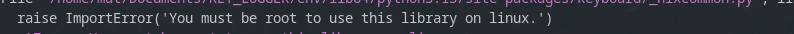

## Key Logger in Python
---
### Objective  

To implement a keylogger in a controlled environment to understand its use in insecure settings. This practice is educational and must not be used for unethical or illegal purposes. The key presses will be logged into a `.txt` file.

---
### Execution Steps
---

1. Clone the repository:
    ```bash
    git clone https://github.com/mat1520/KEY_LOGGER.git
    ```

2. Navigate to the project directory:
    ```bash
    cd KEY_LOGGER
    ```

3. Install the required dependencies:
    ```bash
    pip install -r requirements.txt
    ```

4. Run the keylogger script:
    ```bash
    python main.py
    ```

5. Check the output log file for recorded key presses.
---
### Note for Linux Users

If you are using Linux, remember to activate the keylogger with root privileges to ensure it functions correctly.



---

**Creado por:** [mat1520](https://github.com/mat1520)